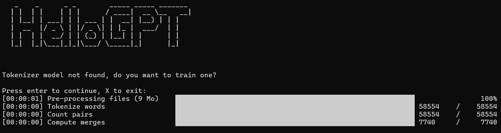
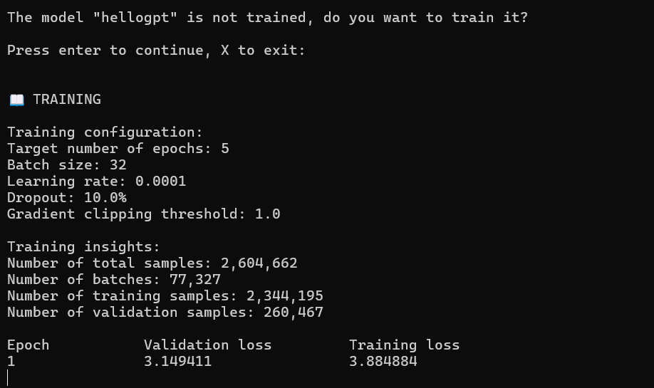

  

# hellogpt
HelloGPT is a small-scale GPT-style model designed to showcase the building blocks of modern language models, including token embeddings, positional embeddings, self-attention, and feed-forward layers.

## Getting started
Python is required to run this project. It can be downloaded from [Python's website](https://www.python.org/downloads/) or [Anaconda](https://www.anaconda.com/download). The project was tested with Python 3.13.5, using Anaconda.

### Dependencies
Dependencies are documented in the file `requirements.txt`. All required dependencies can be installed with the command:

`pip install -r requirements.txt`

**Note:** PyTorch is not included in the requirements.txt file but is required. You can install it following the instructions on the official PyTorch website, which provides a tool to generate the correct installation command for your system.

### Running the project
If the previous steps completed successfully, run the main application with `python main.py`.

`Note: the command python could be different in your environment: py, python3.`

### Using the application
This project provides a console application to interact with the different aspects of the model, including training the tokenizer, training the model and prompting the model.

When the application detects the tokenizer model is not found, it will prompt the user to create one:

Likewise, the application detects a model is not trained, it will prompt the user to train a new model.

Once the model is trained, the chat will be accessible through the console application, this is an example of the word Elizabeth with a training set of Pride and Prejudice, along with other classic novels and tales:

Here is an example with the word Scarecrow from The Wizard of Oz:

### Project structure
- **main.py:** Entry point of the project. Provides a user-friendly way to interact with the model and run training.
- **data/:** This folder stores the training data, the README.md inside contains more details.
- **artifacts/:** This folder stores the artifacts produced by the project.
  - `checkpoints/` will store the model's state.  
  - `tokenizer/` will store the trained tokenizer.
- **src/:** This folder stores the source code of the project.
- **tests/:** This folder stores the tests files. To execute the tests, run `pytest`, `pytest smoke` for smoke test or `pytest integration` for integration tests.

## Training
The easiest way to train a model is through the console application `main.py`, but there are a few important points to keep in mind.

### Checkpoints directory structure
Let's review the checkpoints structure in more detail:

- **artifacts/:** This folder stores the artifacts produced by the project.
  - `checkpoints/` Stores store the model's state.
    - `model_name`: Named according to the value provided in the configuration.
      - `serial_1.pt`: The trainer ensures that no existing serial is overwritten.

### Training a new model
As seen in the checkpoints directory structure, the model is tied to the `model_name` defined in `src/config.py`. This serves as the main versioning mechanism when working with different datasets or testing a different model configuration.

It is recommended to retrain the tokenizer when training on a different dataset.  

To do this, simply delete the folder `artifacts/tokenizer`. The console application will then prompt you to retrain the tokenizer.

## Hardware requirements
Training AI/ML models today is very computationally intensive, even for small models like the one in this project. For this reason, it is recommended to use at least one GPU during training. Tests were carried out on an NVIDIA RTX 3060.

**Important:** Currently, only NVIDIA GPUs are supported by PyTorch, the ML/AI framework used in this project. PyTorch requires the CUDA toolkit to be installed on your system, which can be downloaded [here](https://developer.nvidia.com/cuda-toolkit).

## Model architecture:
- 1 -> Embeddings lookup and addition
- 2 -> Dropout
- 3 -> -> -> Transformers
- 4 -> Layer normalization
- 5 -> Head layer

#### Description:
- 1\) Encodes tokens and their position in the sequence.
- 2\) Randomly disables activations to prevent model overfitting.
- 3\) Applies self attention and feed-forward networks to enrich embeddings with contextual information.
- 4\) Stabilizes training and prevent gradient spikes.
- 5\) Linear projection mapping each token embedding to the vocabulaby logits.

## Transformer architecture:

#### Attention block
- CM -> Causal mask
- LN -> Layer normalization
- AT -> Multi-head attention
- RD -> Residual connections + dropout
  
#### Feed-forward block
- LN -> Layer normalization
- FF -> Feed-forward sub-layers
- RD -> Residual connections + dropout

#### Description:
- CM) Prevents tokens from attending to future positions.
- LN) Stabilizes training and prevent gradient spikes.
- AT) Enriches embeddings with contextual information.
- FF) Neural network applied independently to each token embedding to produce a refined representation.
- RD) Prevents gradient vanishing by letting it flow through the skip path. Drop out is also applied to disable activations and prevent overfitting.
